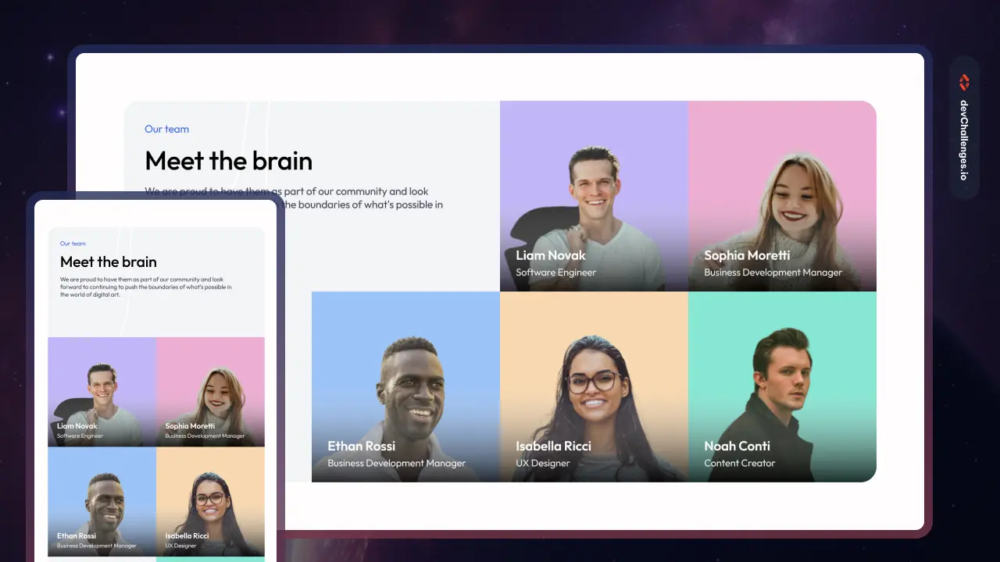

<h1><a href="https://devchallenges.io/challenge/meet-the-team-section-challenge">Meet the Team Section</a></h1>

You are required to build a meet the team section website with the following elements: 5 images representing 5 members, each including their name and job title.

Goals
The goals of this project are to help you:

Practice building Grid layout, position relative/absolute, and create a responsive layout.
Practice more advanced Grid techniques.
Enhance your HTML and CSS skills while creating a visually appealing and user-friendly our team section.
Gain experience working with HTML and CSS to structure and style the website.
Improve your understanding of styling tables, position relative/absolute, and responsive design.
Create visually appealing and user-friendly web pages.
Showcase your HTML and CSS skills and create an engaging pricing table section.
Requirements
You should create a web page that displays a meet the team section with the following features:

Use grid layout in CSS to structure the layout
Include 5 images representing 5 members, each including their name and job title
Style the layout to be responsive and adapt to different screen sizes
About
Build a meet the team section website challenge with provided design. The layout should have 5 images representing 5 members, each including their name and job title. The goal of this challenge is to practice grid layout and position absolute/relative, and style a responsive layout. This project idea is perfect for intermediate developers who want to enhance their HTML and CSS skills while creating a visually appealing and responsive website. By implementing a meet the team section using grid layout and position absolute/relative, you will learn how to create a complex and visually appealing web page that adapts to different screen sizes. Additionally, you will gain experience working with HTML and CSS to structure and style the website. This project will help you improve your understanding of grid layout, position absolute/relative, responsive design, and create visually appealing and user-friendly web pages. Get ready to showcase your HTML and CSS skills and create an engaging meet the team section!

Tech Stack
For this project, it is recommended to use only HTML and CSS to create the web page. You can use any text editor or integrated development environment (IDE) to write your code. There are no specific requirements for the choice of HTML and CSS frameworks or libraries. It is recommended to use vanilla HTML and CSS for this project, but you can also choose to use popular frameworks like Tailwind CSS if you prefer.

User stories

Create a meet the team section website with 5 images representing 5 members, each including their name and job title.

Utilize grid layout in CSS to structure the layout.

Style the layout to be responsive and adapt to different screen sizes.

Apply clean spacing and typography to enhance the overall design.

Ensure the website is accessible and user-friendly.

Test the website on different devices and screen sizes to ensure responsiveness.

Optimize the website for performance and loading speed.

Use semantic HTML elements to structure the content and improve SEO.

Apply CSS styles to enhance the visual presentation of the team member elements.

(Optional) Add hover effects or animations to make the website more interactive.

Validate the HTML and CSS code to ensure it follows best practices and standards.

Document the code and provide clear instructions on how to run and use the website.

Deploy the website to make it accessible for everyone.

